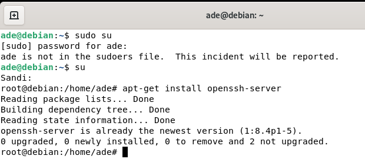
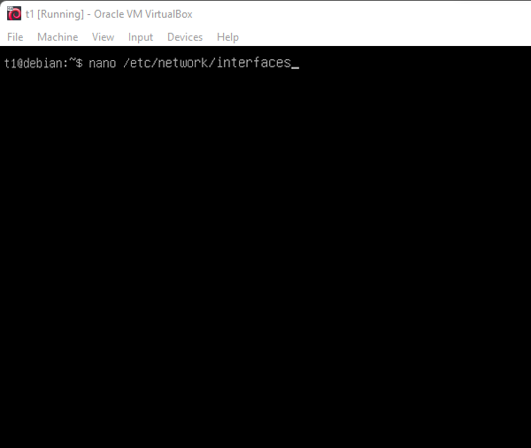
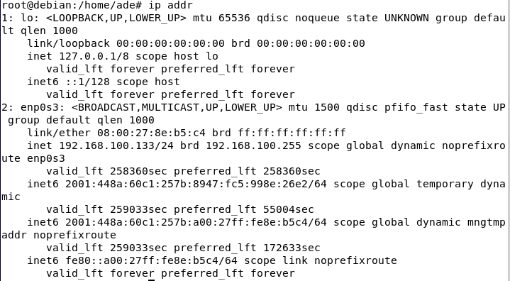
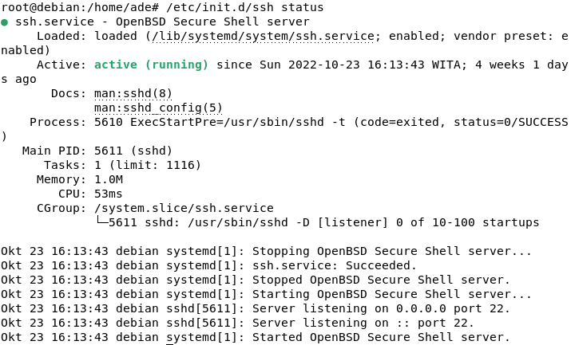
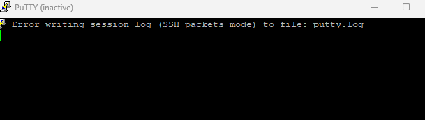

# SSH (REMOTE ACCESS)

1.Pertama, jalankan mesin virtual Debian 11 Linux lalu klik mesin virtual Debian 11 kemudian klik tombol mulai.
2.Setelah itu terbuka masukkan kata sandi lalu cari terminal.
3.Lalu tulis su dan masukkan password. 
4.Ketiga ketikan apt-get install openssh-server jika tiak bisa ketikkan dan jika berhasil akan tampil seperti gambar dibawah ini. 
, karena saya sudah menginstall maka akan seperti itu.
5.Keempat kita cek ip addresnya dengan mengetikan "ip addr"

dan mencek status ssh server yang sudah di install dengan mengetik " /etc/init.d/ssh status"

6.Kelima masukkan ip address pada futty akan tetapi punya saya eror padahal ip yang saya ketikan sama dengan ip addr saya.  
