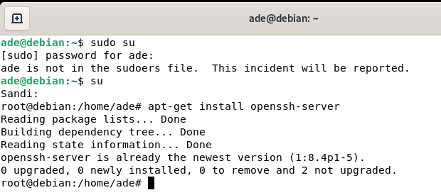
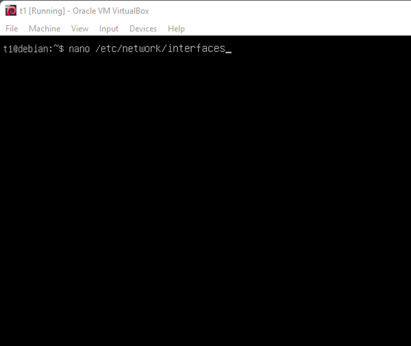
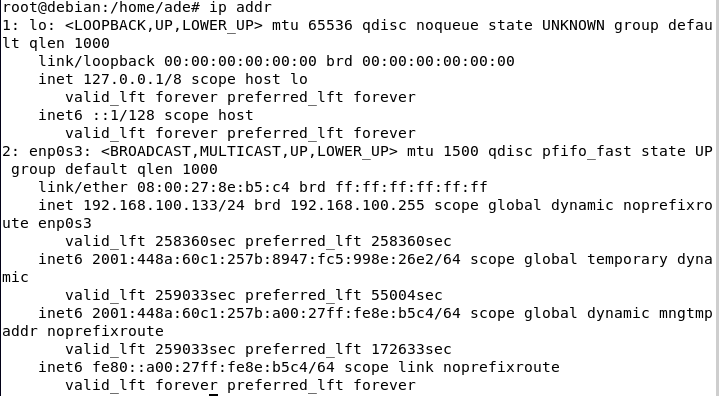

# Cara Menghubungkan client-server dengan Windows

1. -  Buka VirtualBox kemudian setting Network virtual machine Debian anda dengan menggunakan adapter Host Only.
Jika belum mempunyai Adapter Host Only, silahkan dibuat terlebih dahulu di : File => Host Network Manager (ctrl + w), kemudian tambahkan adapternya.
2. -  Kemudian nyalakan (booting) Virtual OS Debian pada VirtualBox (Virtual Machine anda).
3. -  Login sebagai root, supaya bisa mengedit dan melakukan konfigurasi.

4. -  Ketik perintah terminal : nano /etc/network/interfaces lalu tekan Enter.

Jika tidak tahu cara mengkonfigurasi ip address pada Debian server seilahkan kunjungi artikel berikut : Cara Konfigurasi IP Address Debian Server.
5. -  Jika punya anda masih tertulis “allow-hotplug” ganti dengan kode “auto” kemudian dibawahnya karena kita menggunakan IP Static maka ganti “dhcp” menjadi “static”.
6. -  Kemudian save dengan cara menekan tombol keyboard “ctrl + x kemudian Y kemudian Enter.
7. -  Kemudian reboot service networking dengan cara mengetikan perintah terminal :
“/etc/init.d/networking restart” (tanpa tanda petik).
8. -  Untuk mengecek IP gunakan perintah terminal : “ip a".
Jika terdapat IP ganda abaikan saja karena itu hanya chache.
9. -  Sekarang kita akan mengkonfigurasi IP Address pada Windows (Client).
Buka Control Panel => Network and Internet => Network and Sharing Center => Change Adapter Setting. Kemudian pastikan adapter virtualbox host only dalam keadaan aktif (enable).
10. -  Klik kanan pada adapter virtualbox host only => Properties => Internet Protocol Version 4 (TCP/IPv4) => Properties. Kemudian masukan IP yang satu subnet (satu network) dengan ip Debian Server kita.
11. -  Kemudian klik ok.
12. -  Test koneksi dengan menggunakan PING dari Windows (Client) ke Debian (Server) dan sebaliknya.
ping dari Debian ke Windows:
